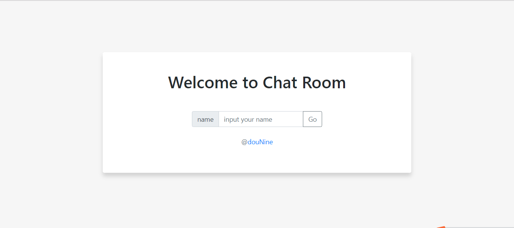
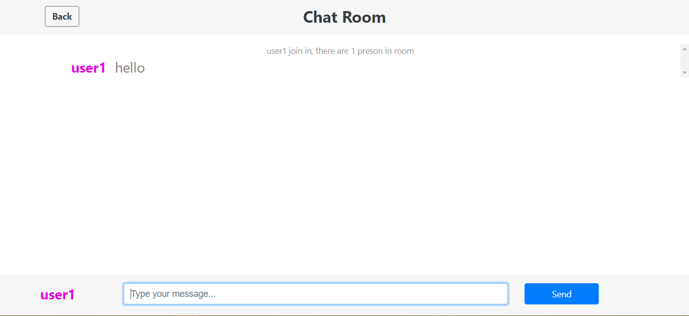
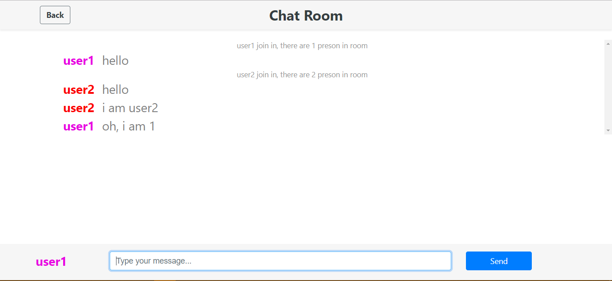
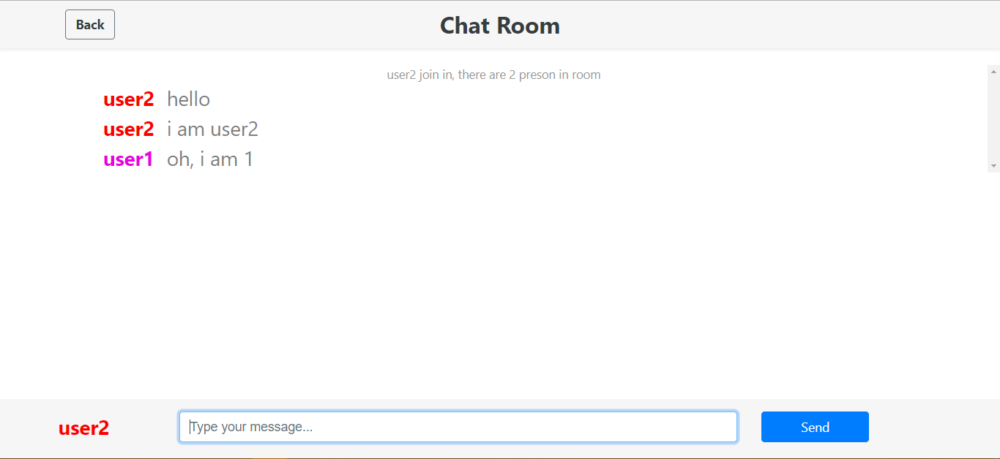

# chatRoom

一个用webSocket、go语言和beego框架实现的聊天室 (a chat room made by webSocket, go and beego)

## 简介(introduction)

聊天室基础：WebSocket协议，能使客户端与服务器之间长时间通信。

使用语言：go语言，拥有并发特性。

框架：beego框架，MVC模式。

前端页面：bootstrap + jQuery。

## 展示(display)

登录：



聊天：







## 使用(how to use)

### 准备(preparation)：

go 环境 + beego 框架

### 下载(download)：

`go get github.com/99MyCql/chatRoom`

或

`git clone https://github.com/99MyCql/chatRoom.git` 然后 `mv chatRoom $GOPATH/src/github.com/99MyCql/`

由于项目中包导入的问题，一定要放在该路径下。

### 运行(run)：

```bash
cd chatRoom
bee run
```

## 详细文档(detailed documentation)

见`doc.md`